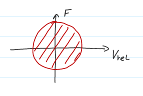
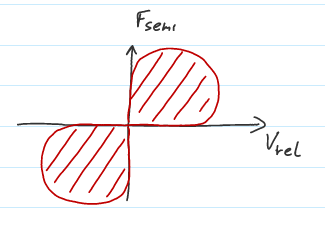

# Typy aktivních a poloaktivních aktuátorů

## Aktivní aktuátory
Zdroje řízených akčních sil
	
+ pieozelektrické materiály - velký poměr síla/hmotnost, ale nízký zdvih
+ hydraulické aktuátory - nízká šířka pásma řízení síly
+ elektromagnetické (voice coil acutator) - možnost skoro nulové tuhosti

## Poloaktivní
Zdroje řízených tlumících sil (řízená disipace energie)

* tlumič s magnetoreologickou kapalinou
* tlumič se škrtícím ventilem

