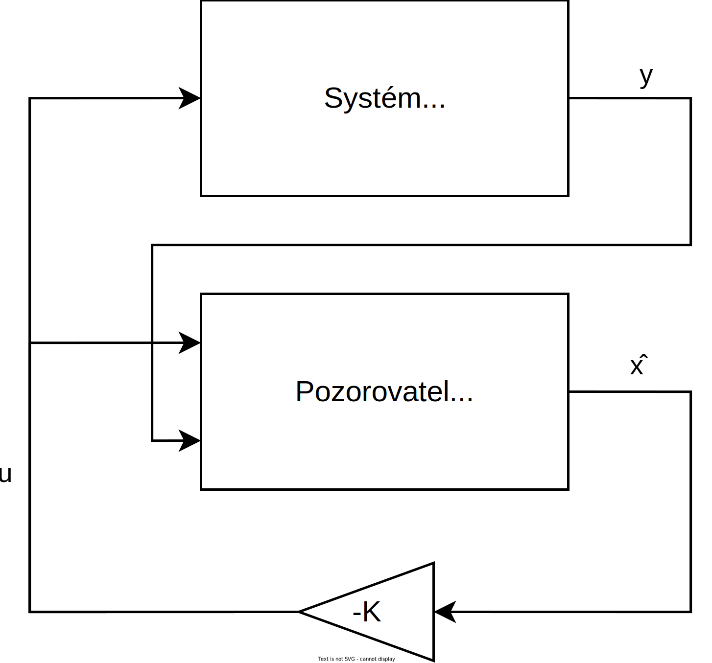

Stavový Pozorovatel
===================

Uvažujme lineární systém ve tvaru
```math
\begin{aligned}
	\bm{ẋ} &= \bm{A} \bm{x} + \bm{B} \bm{u}
	\\
	\bm{y} &= \bm{C} \bm{x}
\end{aligned}
```
kde

* ``\bm{x}`` vektor stavů
* ``\bm{u}`` vektor vstupů
* ``\bm{y}`` vektor výstupů

a jeho pozorovatele s identickými charakteristikami ``\bm{A}``, ``\bm{B}``, ``\bm{C}`` a rozšířenou zpětnou vazbou o rozdíl výstupů
```math
\begin{aligned}
	\dot{\hat{\bm{x}}} &= \bm{A} \hat{\bm{x}} + \bm{B} \hat{\bm{u}} + \bm{L}( \bm{y} - \hat{\bm{y}} )
	\\
	\hat{\bm{y}} &= \bm{C} \hat{\bm{x}}
\end{aligned}
```

Pokud definujeme odchylku jeho stavu od stavu systému jako ``\bm{ε} = \bm{x} - \hat{\bm{x}}``, odečtením stavového popisu pozorovatele od popisu systému získáme její stavový popis
```math
\dot{\bm{ε}} = (\bm{A} - \bm{L} \bm{C} )\,\bm{ε} \,,\quad 
```

Systém po té můžeme řídit pomocí zpětné vazby používající stavy pozorovatele (viz. obrázek)

---

