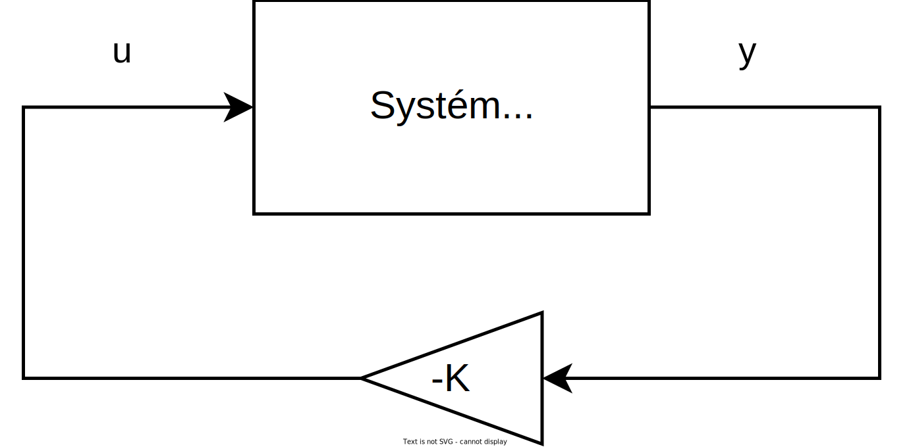

Výstupní zpětná vazba
=====================

Uvažujme lineární systém ve tvaru
```math
\begin{aligned}
	\bm{ẋ} &= \bm{A} \bm{x} + \bm{B} \bm{u}
	\\
	\bm{y} &= \bm{C} \bm{x}
\end{aligned}
```
kde

* ``\bm{x}`` vektor stavů
* ``\bm{u}`` vektor vstupů
* ``\bm{y}`` vektor výstupů

Lineární zpětnou vazbu lze zavést jako
```math
\bm{u} = - \bm{K}\bm{y}
```
přičemž výsledný stavový popis systému lze upravit do tvaru
```math
\bm{ẋ} = (\bm{A} - \bm{B}\bm{K}\bm{C}) \bm{x}
```

---

